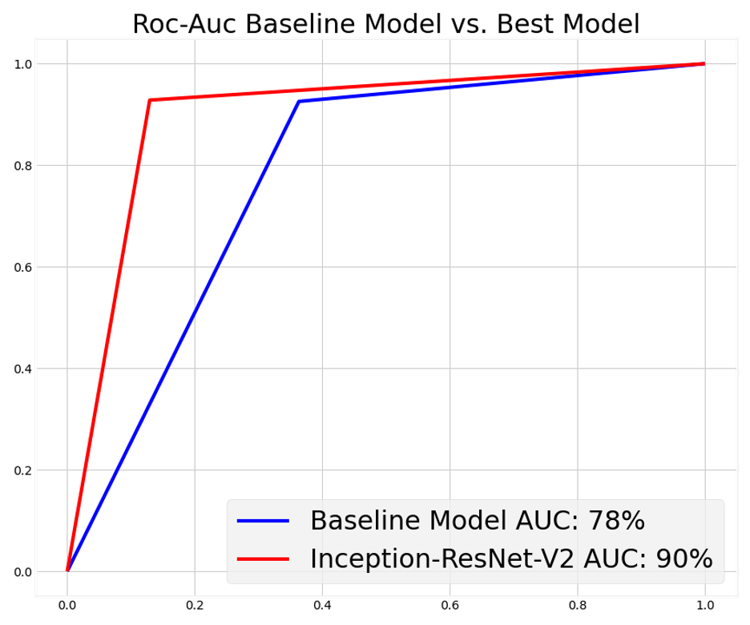
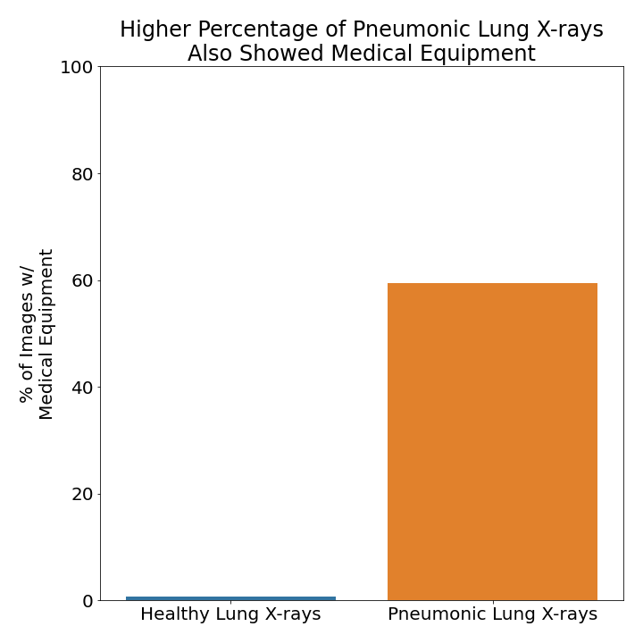
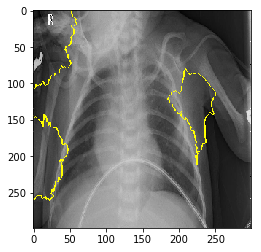

# Improving Radiology Efficiency with AI

An image classification project using x-ray data from mendelay.

## Table of Contents

<!--ts-->
 * [Files and Folders of Note](https://github.com/mesterhammerfic/x_ray_classification#files-and-folders-of-note)
 * [General Setup Instructions](https://github.com/mesterhammerfic/x_ray_classification#general-setup-instructions)
 * [Goal](https://github.com/mesterhammerfic/x_ray_classification#goal)
 * [Preview of Results](https://github.com/mesterhammerfic/x_ray_classification#status)
 * [Data](https://github.com/mesterhammerfic/x_ray_classification#data)
 * [Next Steps](https://github.com/mesterhammerfic/x_ray_classification#next-steps)
<!--te-->

## Files and Folders of Note
```
.
├── README.md
├── data
├── environment.yml
├── notebooks
│   ├── exploratory
│   │   ├── 01_mef_base_model.ipynb
│   │   ├── 02_lime_explanation_template.ipynb
│   │   ├── 03_intermediate_activations_template.ipynb
│   │   ├── 04_convolutional_model.ipynb
│   │   ├── 05_jw_transfer_learning.ipynb
│   │   ├── 06_jw_iterations.ipynb
│   │   ├── 07_jw_best_model.ipynb
│   │   └── fsm_model.pickle
│   └── report
│       └── final_notebook.ipynb
├── references
│   ├── PIIS0092867418301545.pdf
│   ├── person109_bacteria_519.jpeg
│   └── person3_virus_15.jpeg
├── reports
│   ├── figures
│   │   ├── Results_AUC_ROC.png
│   │   ├── after_cleaning.png
│   │   ├── before_cleaning.png
│   │   ├── data_cleaning.png
│   │   └── model_comparison.png
│   └── presentation
│       └── x_ray_classification.pdf
└── src
    ├── functions.py
    └── lime_functions.py
```
#### Repo Navigation Links

 - [presentation.pdf](https://github.com/mesterhammerfic/x_ray_classification/blob/master/reports/presentation/x_ray_classification.pdf)
 - [/reports](https://github.com/mesterhammerfic/x_ray_classification/tree/master/reports) - contains the final notebook that describes our findings
 - [/notebooks](https://github.com/mesterhammerfic/x_ray_classification/tree/master/notebooks) - contains step by step descriptions of our process including data exploration and model iterations
 - [/src](https://github.com/mesterhammerfic/x_ray_classification/tree/master/src) - contains all scripts that are used in the notebooks/ and reports/ files
 
## General Setup Instructions 

Ensure that you have installed [Anaconda](https://docs.anaconda.com/anaconda/install/) 

#### `x_ray` conda Environment

This project relies on you using the [`environment.yml`](environment.yml) file to recreate the `x_ray` conda environment. To do so, please run the following commands *in your terminal*:
```bash
# create the x_ray conda environment
conda env create -f environment.yml
# activate the x_ray conda environment
conda activate x_ray
# if needed, make housing available to you as a kernel in jupyter
python -m ipykernel install --user --name x_ray --display-name "Python 3 (x_ray)"
```

#### Tools
 - Python 3.8
   - tensorflow
   - keras
   - matplotlib
   - seaborn
   - lime
 - Anaconda
 - JupyterLab

## Goal
Create a tool that uses Convolutional Neural Networks to assist in diagnosing patients with pneumonia based on their x-rays. Our tool will be optimized for sensitivity to minimize the number of patients who go undiagnosed. This project is aimed at hospital administrators who are looking to increase the efficiency of their radiology departments and our final product will be built with ease-of-use in mind.

#### Objective
- Build a tool that uses a Convolutional Neural Network (CNN) to assist in diagnosing patients with Pneumonia. This Neural Network will reliably identify patients with pneumonia so radiologists and doctors can prioritize those patients for quicker review, diagnoses, and treatment.

## Status
 
<h4 style="text-align:left;">Best Model</h4>
We achieved the best detection of Pneumonia in chest x-rays with the InceptionResNetV2 Convolutional Neural Network. This CNN has been trained on over a million images from the ImageNet database. If you would like to know more about the model, take a look over the documentation below. 

We chose to fine tune this model by training the layers in the model after the 750th layer. We also set the Early Stopping Callback parameter to a patience level of 14 and to restore the best weights. We set the number of epochs for the model to train at 50 but the model was called back after epoch 16 due to the loss metric no longer improving. The model was optimized for Recall, limiting the amount of False Negatives. Validating this model on the unseen test x-rays, we achieved a recall score of 97%. Therefore, out of all patient x-rays indicating a form of Pneumonia, our model successfully flagged 97% of them.


[InceptionResNetV2 Documentation](https://scisharp.github.io/Keras.NET/api/Keras.Applications.Inception.InceptionResNetV2.htm)


<h4 style="text-align:center;">Inception-ResNet-V2</h4>


|             | Recall | Precision | Accuracy | Support |        |                   
|-------------|-----------|--------|----------|---------|--------|
| **Normal** |   95%    |  84%  |   89%   |  232   |    
| **Pneumonia** |   84%    |  94%  |   89%   |  195   |   

<h4 style="text-align:center;">Test Validation</h4>

|                           |           |
|---------------------------|-----------|
|  **Recall**             |     97%       
|  **Precision**        |   84%      
|  **Accuracy**     |   89%      
| **Roc-Auc**       |   89%

 

## Data
The data was originally downloaded from [this](https://www.kaggle.com/paultimothymooney/chest-xray-pneumonia) kaggle dataset, which references a study published by Cell which can be found [here](https://www.cell.com/cell/fulltext/S0092-8674(18)30154-5). The dataset includes x-ray images from both healthy patients and patients with pneumonia. Both bacterial and viral pneumonia are represented and labeled in this data set. X-ray views are only either posterior or anterior chest views. The diognoses used to classify the images were reviewed by the original research team with the help of two expert physicians.

#### Note on Cleaning:

 
The images were found to have what look like medical equipment in the x-rays, such as electrodes, IV tubes, and catheters. The pneumonia positive x-rays had a far higher rate of these objects which could lead to a false sense of model performance. We deduced that the pneumonia-positive x-rays were drawn from patients who were either already being treated for pneumonia or were suffering from illnesses that may have led to pneumonia. LIME analysis also indicated that some of our neural networks learned to look for these medical devices when making their diagnoses. The image below shows which areas the model was looking at when making a diagnosis. The model used in this image was trained on the original data.

 

Due to time contraints, we elected to delete the images with medical devices from our training data, but not from our test and validation data. We left the images-with-devices in the test and validation data to ensure that our model would still be able to diagnose with those objects present. The following image image depicts the same model trained on the cleaned data, showing that it is now looking at the actual lungs when making a diagnosis.

 

#### Note on Validation Set:

The original validation set had only 16 images in it, which made it difficult to gauge model performance as it progressed through the epochs. Essentialy, the small validation size meant that for each incorrect classification the validation performance would rise or drop no less than 6%. We increased the validation set size by drawing from the training data, allowing us to more accuractely gauge the models performance through the epochs.

#### Download:

The data we are using can be found [here](https://www.dropbox.com/s/r23oastdde1v215/chest_xray.zip?dl=0) and should be unzipped into the [data](/data) folder in this projects main directory.
 
## Next Steps:
 - Make the model more transparent in order to troubleshoot errors in classification
 - See how well the model generalizes to other ailments identified by x-rays
 - Diagnose the type of pneumonia ie viral vs bacterial
 - Classify the severity of Pneumonia

#### Team Members:

Chum Mapa: chaminda.mapa@gmail.com

Syd Rothman: sydrothman@gmail.com

Jason Wong: jwong853@gmail.com

Maximilian Esterhammer-Fic: mesterhammerfic@gmail.com
